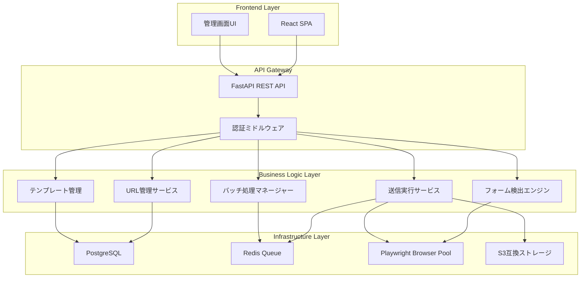

# 技術設計

## 概要
企業ウェブサイトの問い合わせフォームを自動検出・入力・送信するWebサービスの技術設計。ヘッドレスブラウザを活用した動的フォーム対応、テンプレートベースの入力管理、バッチ処理によるスケーラビリティを実現します。

## アーキテクチャ



## 技術スタック

- **Frontend**: React 18 + TypeScript + Tailwind CSS
- **Backend**: FastAPI (Python 3.11+) + Pydantic
- **Database**: PostgreSQL 15 + SQLAlchemy ORM
- **Queue**: Redis 7 + Celery
- **Browser Automation**: Playwright (Chromium)
- **Authentication**: JWT + OAuth2
- **Storage**: MinIO (S3互換)
- **Testing**: pytest + Playwright Test
- **Deployment**: Docker + Kubernetes

## コンポーネントと インターフェース

### APIエンドポイント

```
# 企業URL管理
GET    /api/companies                    # 企業一覧取得
POST   /api/companies                    # 企業追加
PUT    /api/companies/:id               # 企業情報更新
DELETE /api/companies/:id               # 企業削除

# フォーム検出
POST   /api/detect-form                 # フォーム検出実行
GET    /api/forms/:company_id           # 検出済みフォーム取得

# テンプレート管理
GET    /api/templates                   # テンプレート一覧
POST   /api/templates                   # テンプレート作成
PUT    /api/templates/:id              # テンプレート更新
DELETE /api/templates/:id              # テンプレート削除

# 送信管理
POST   /api/submissions/single          # 単一送信
POST   /api/submissions/batch           # バッチ送信
GET    /api/submissions/history         # 送信履歴
GET    /api/submissions/:id             # 送信詳細

# スケジューリング
POST   /api/schedules                   # スケジュール作成
GET    /api/schedules                   # スケジュール一覧
DELETE /api/schedules/:id              # スケジュール削除
```

### データフロー

1. **フォーム検出フロー**
   - ユーザーが企業URLを入力
   - Playwrightでページをロード
   - DOM解析で問い合わせリンクを検出
   - フォームページに遷移
   - フォーム要素を解析・保存

2. **自動送信フロー**
   - テンプレート選択
   - フォームフィールドマッピング
   - Playwrightで入力実行
   - CAPTCHA検出・通知
   - 送信結果の記録

## データモデル

```typescript
// 企業情報
interface Company {
  id: string;
  name: string;
  url: string;
  lastSubmittedAt?: Date;
  status: 'active' | 'inactive' | 'blocked';
  metadata: Record<string, any>;
  createdAt: Date;
  updatedAt: Date;
}

// フォーム情報
interface Form {
  id: string;
  companyId: string;
  formUrl: string;
  fields: FormField[];
  submitButtonSelector: string;
  hasRecaptcha: boolean;
  detectedAt: Date;
}

// フォームフィールド
interface FormField {
  name: string;
  type: 'text' | 'email' | 'tel' | 'textarea' | 'select' | 'radio' | 'checkbox';
  selector: string;
  label?: string;
  required: boolean;
  options?: string[];
}

// テンプレート
interface Template {
  id: string;
  name: string;
  category: string;
  fields: TemplateField[];
  variables: Variable[];
  createdAt: Date;
  updatedAt: Date;
}

// 送信履歴
interface Submission {
  id: string;
  companyId: string;
  templateId: string;
  status: 'pending' | 'success' | 'failed' | 'captcha_required';
  submittedData: Record<string, any>;
  response?: string;
  errorMessage?: string;
  submittedAt: Date;
  screenshotUrl?: string;
}

// スケジュール
interface Schedule {
  id: string;
  name: string;
  companyIds: string[];
  templateId: string;
  cronExpression: string;
  enabled: boolean;
  lastRunAt?: Date;
  nextRunAt: Date;
}
```

## エラーハンドリング

### エラー種別と対処

1. **ネットワークエラー**
   - リトライ機構（指数バックオフ）
   - タイムアウト設定（30秒）
   - エラーログ記録

2. **フォーム検出エラー**
   - 代替検出アルゴリズム
   - 手動URL指定オプション
   - エラー詳細の提供

3. **CAPTCHA検出**
   - ユーザー通知
   - 手動介入UI提供
   - 一時停止機能

4. **レート制限**
   - 送信間隔の自動調整
   - キュー管理
   - 優先度制御

## セキュリティ考慮事項

### 認証・認可
- JWT トークンベース認証
- リフレッシュトークン機構
- ロールベースアクセス制御（RBAC）
- 二要素認証（TOTP）

### データ保護
- PostgreSQL レベルの暗号化
- 送信データの暗号化保存
- HTTPSのみの通信
- XSS/CSRF対策

### コンプライアンス
- robots.txt 遵守チェック
- User-Agent 適切な設定
- レート制限の実装
- 利用規約チェック機能

## パフォーマンス＆スケーラビリティ

### ブラウザプール管理
```python
# Playwrightブラウザプール設定
BROWSER_POOL_SIZE = 10
MAX_PAGES_PER_BROWSER = 5
BROWSER_TIMEOUT = 60000  # 60秒
```

### キャッシング戦略
- Redis によるフォーム構造キャッシュ
- 企業情報の15分キャッシュ
- テンプレートのメモリキャッシュ

### スケーリング
- 水平スケーリング対応設計
- Celery ワーカーの動的スケール
- データベース読み取りレプリカ
- CDNによる静的ファイル配信

## テスト戦略

### ユニットテスト
- pytest によるビジネスロジックテスト
- モックを使用したブラウザ操作テスト
- データベース操作のテスト

### 統合テスト
- API エンドポイントテスト
- フォーム検出精度テスト
- 実際のWebサイトでの動作確認

### E2Eテスト
- Playwright Test による画面操作テスト
- バッチ処理の完全フロー確認
- エラーハンドリングの検証